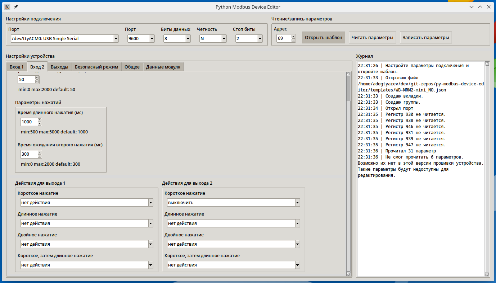

# py-modbus-device-editor
Утилита редактирования параметров Modbus-устройств

Проверено в Python 3.10.9 под Linux.

Установите pymodbus:
```
 pip3 install pymodbus
```
Запустите утилиту:
```
python main.py
```

